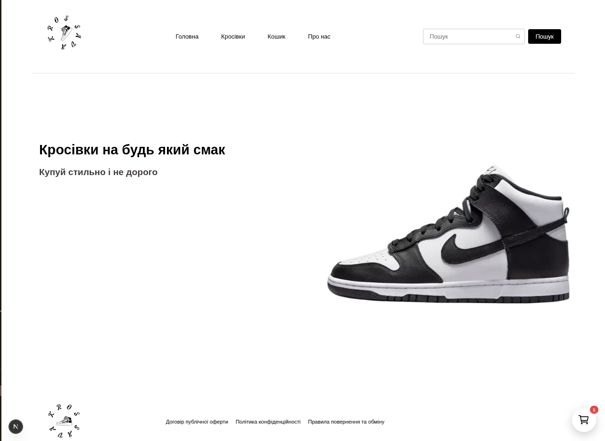

# 👟 Krossava Store

A modern sneaker e-commerce web application built with **Next.js 16**, **TypeScript**, **Express.js**, **MongoDB**, and **Algolia Search**.

The project includes a responsive storefront, product search, filtering, shopping cart, Telegram order notifications, automatic product synchronization, and SEO optimization.

---

## 🚀 Live Demo

🌐 **Website:** https://krossava.com.ua

---

## 📸 Preview

> Add screenshots here.

| Home                          | Catalog                          | Product                          |
| ----------------------------- | -------------------------------- | -------------------------------- |
|  |  |  |

---

# ✨ Features

- 🛒 Sneaker online store
- 🔍 Full-text search powered by Algolia
- 📂 Category filtering
- 📏 Size filtering
- 📄 Pagination
- ❤️ Shopping cart
- 📦 Order form
- 📲 Telegram order notifications
- ⚡ Server Side Rendering (SSR)
- 🚀 Optimized performance
- 🔎 SEO optimized
- 🤖 Automatic product synchronization
- 📱 Fully responsive design

---

# 🛠 Tech Stack

## Frontend

- Next.js 16 (App Router)
- React 19
- TypeScript
- CSS Modules
- Axios
- Zustand
- Formik
- Yup
- React Hot Toast
- React Icons

---

## Backend

- Node.js
- Express.js
- MongoDB
- Mongoose
- Celebrate (Joi)
- Axios
- CORS

---

## Search

- Algolia Search

---

## Deployment

- Vercel
- Render

---

## Automation

- GitHub Actions
- Daily product synchronization
- Automatic Algolia indexing

---

# 📂 Project Structure

```text
Frontend
│
├── app/
├── components/
├── public/
└── src/
    ├── hooks/
    ├── lib/
    ├── store/
    └── types/

Backend
│
├── src/
│   ├── controllers/
│   ├── db/
│   ├── middlewares/
│   ├── models/
│   └── routers/
└── scripts/
```

---

# ⚙️ Installation

## Clone repository

```bash
git clone https://github.com/your-username/krossava-store.git
```

## Install dependencies

```bash
npm install
```

## Start Frontend

```bash
npm run dev
```

## Start Backend

```bash
npm run dev
```

---

# 🔐 Environment Variables

## Frontend

```env
NEXT_PUBLIC_API_URL=
```

## Backend

```env
PORT=

MONGODB_URL=

ALGOLIA_APP_ID=
ALGOLIA_ADMIN_KEY=
ALGOLIA_INDEX_NAME=

TG_API_KEY=
TG_ID=
```

---

# 🔄 Automatic Product Synchronization

Products are synchronized automatically every day using **GitHub Actions**.

Synchronization process:

1. Download supplier XML feed
2. Fully update MongoDB database
3. Synchronize Algolia Search index

---

# 🔎 SEO

The project implements modern SEO practices.

- Dynamic Metadata API
- Open Graph
- Twitter Cards
- Canonical URLs
- robots.txt
- sitemap.xml
- Schema.org Structured Data
  - Organization
  - OnlineStore
  - Product
  - BreadcrumbList
- Optimized metadata
- Dynamic product metadata

---

# 📦 Main Functionality

- Browse products
- Product search
- Category filtering
- Size filtering
- Product details page
- Shopping cart
- Checkout form
- Telegram order notifications
- Automatic database synchronization

---

# 📱 Responsive Design

Optimized for:

- 💻 Desktop
- 📱 Tablet
- 📲 Mobile

---

# ⚡ Performance

Implemented optimizations:

- Next.js Image Optimization
- Lazy Loading
- Dynamic Metadata
- Server Components
- Code Splitting
- WebP Images
- Optimized Fonts

---

# 📊 Lighthouse Goals

- ✅ Performance
- ✅ Accessibility
- ✅ Best Practices
- ✅ SEO

---

# 📈 Future Improvements

- User authentication
- Wishlist
- Product reviews
- Favorites
- Payment integration
- Admin dashboard
- Product recommendations

---

# 📜 License

This project was created for commerce and portfolio purposes.

---

# 👨‍💻 Author

**Vlad Harkusha**

- GitHub: https://github.com/RavemanThc
- Website: https://krossava.com.ua
  > > > > > > > dc2a03a (add seo)
